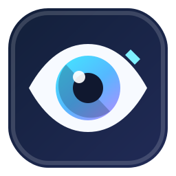
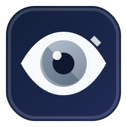
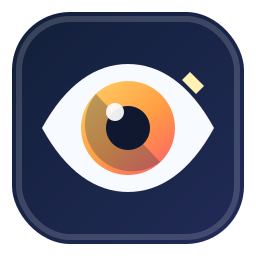

# SightAdapt tray icon

This document defines the proposed system tray icon for SightAdapt and its visual states.

## Concept

The icon combines an **eye** with an **adaptive color lens**:

- the eye represents visual accessibility and window-image processing;
- the split, colored iris represents inversion, LUTs, brightness, contrast, saturation, and other visual profiles;
- the small adjustment notch indicates that the displayed image is being transformed;
- the dark rounded background keeps the silhouette readable on both light and dark Windows taskbars.

The design intentionally avoids letters and fine outlines so that it remains recognizable at Windows tray sizes.

## States

<table>
  <thead>
    <tr>
      <th>Active</th>
      <th>Inactive</th>
      <th>Emergency / attention</th>
    </tr>
  </thead>
  <tbody>
    <tr>
      <td align="center"></td>
      <td align="center"></td>
      <td align="center"></td>
    </tr>
    <tr>
      <td>At least one visual profile or overlay is active.</td>
      <td>The application is running, but no visual effect is active.</td>
      <td>An emergency shutdown, renderer failure, or state requiring immediate attention.</td>
    </tr>
  </tbody>
</table>

## Source files

- [`sightadapt-tray-active.svg`](assets/icons/sightadapt-tray-active.svg)
- [`sightadapt-tray-inactive.svg`](assets/icons/sightadapt-tray-inactive.svg)
- [`sightadapt-tray-emergency.svg`](assets/icons/sightadapt-tray-emergency.svg)

The SVG files are the canonical editable sources.

## Windows export requirements

The final application resource should be exported as a multi-resolution `.ico` file containing at least:

- 16×16 px;
- 20×20 px;
- 24×24 px;
- 32×32 px;
- 40×40 px;
- 48×48 px;
- 64×64 px;
- 128×128 px;
- 256×256 px.

The 16×16, 20×20, 24×24, and 32×32 exports must be inspected manually at 100% scale. Automatic downscaling may soften the pupil, highlight, or adjustment notch.

## Usage guidelines

- Use the **active** variant for normal enabled operation.
- Use the **inactive** variant when SightAdapt is running without active overlays.
- Use the **emergency** variant only for a temporary warning or failure state; do not use it as the normal enabled icon.
- Keep the eye shape, pupil position, and outer silhouette identical across states so state changes do not look like different applications.
- Do not add text, badges, or extra symbols to tray-size variants.

## Accessibility considerations

Color must not be the only state indicator in menus, settings, or notifications. Pair icon state with explicit text such as **Active**, **Inactive**, or **All overlays stopped**.

The emergency state should not remain visible indefinitely without an accompanying explanation available from the tray menu or notification.
